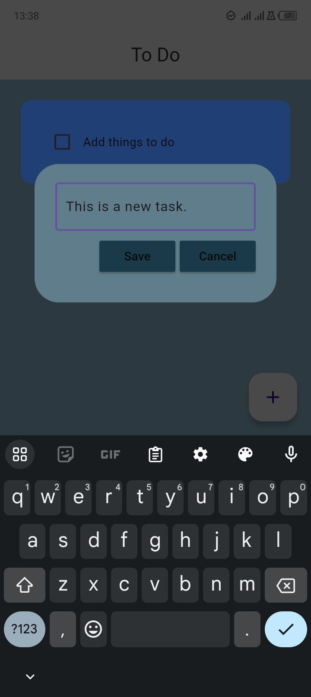
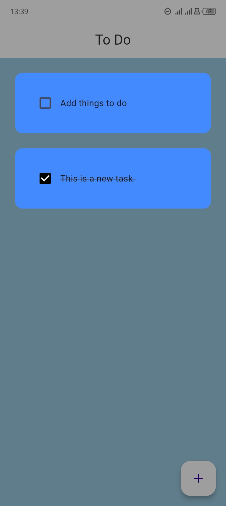
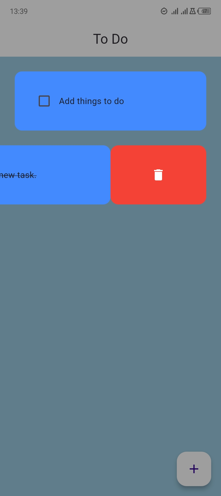

# To-Do List Application

## Overview

This Flutter application is a simple to-do list app that uses Hive as its local database. It allows users to add, update, and delete tasks. The app is designed with a clean UI using MaterialApp.

### Screenshots

*Home Screen displaying tasks*

*Dialog box for adding a new task*

## Features

- Local data persistence with Hive
- Add, remove, and update tasks
- Interactive UI with Material Design

# Setup and Installation

1. **Dependencies**: Ensure you have Flutter and Dart installed on your machine.
2. **Packages**: This app uses the following packages:
   - flutter
   - hive_flutter
   - flutter_slidable
3. **Initialization**:
   - Run flutter pub get to install dependencies.

# Code Structure

### `main.dart`

- **Purpose**: Entry point of the application. Initializes Hive and launches the MainApp.

- **Key Functions**:
  - `main()`: Initializes Hive and opens a box for storage.
  - `MainApp`: The main application widget that sets up `MaterialApp`.

### `home_page.dart`

- **Purpose**: Manages the home screen of the application where tasks are displayed.
- **Key Components**:
  - `HomePage`: Stateful widget that handles the display and interaction with the task list.
  - Methods for:
    - Checking/unchecking tasks
    - Creating new tasks
    - Deleting tasks

### `todo_tile.dart`

- **Purpose**: Provides the UI for individual to-do items.
- **Key Components**:
  - `TodoTile`: Stateless widget that displays a task with options to check and delete it.

### `dialog_box.dart`

- **Purpose**: UI component for adding new tasks.
- **Key Components**:
  - `DialogBox`: Stateless widget that presents a dialog to input a new task.

### `buttons.dart`

- **Purpose**: Custom button widget for uniform styled buttons.
- **Key Components**:
  - `MyButtons`: Stateless widget representing a button.

### `database.dart`

- **Purpose**: Handles data operations like creating, loading, and updating tasks in Hive.
- **Key Components**:
  - `ToDoDB`: Class that manages task data storage and retrieval.

# Usage

- **Adding a Task**: Press the floating action button to add a new task.

  *Screenshot showing the task creation process*

- **Checking a Task**: Tap the checkbox next to a task to mark it as completed.

  *Screenshot showing a completed task*

- **Deleting a Task**: Swipe the task tile to reveal a delete option.

  *Screenshot showing the swipe-to-delete action*

## Demo Video

[Watch the demo video](./lib/assets/video/ToDo_demo.mp4)

